# WIKIPEDIA-LAB


# Wikipedia Pageviews Analysis with Apache Spark on Dataproc

## Overview

This project analyzes user interactions with Wikipedia pages, recorded in the Wikipedia Pageviews dataset. The data contains records of page views, including details such as date, time, language, title, and view counts. 

### Schema of the Data
  root

  |-- datehour: timestamp (nullable = true)

  |-- wiki: string (nullable = true)

  |-- title: string (nullable = true)

  |-- views: long (nullable = true)


### Using Apache Spark to load the Wikipedia pageviews data from a BigQuery table into a Spark DataFrame.
```python
  table = "bigquery-public-data.wikipedia.pageviews_2020"
  df_wiki_pageviews = spark.read \
    .format("bigquery") \
    .option("table", table) \
    .option("filter", "datehour >= '2020-03-01' AND datehour < '2020-03-02'") \
    .load()
```

### Filtering the dataset to include only the English versions of Wikipedia (language code 'en' and 'en.m' for desktop and mobile versions) with more than 100 views.
```python
  df_wiki_en = df_wiki_pageviews \
  .select("title", "wiki", "views") \
  .where("views > 1000 AND wiki in ('en', 'en.m')") \
  .cache()
df_wiki_en
```
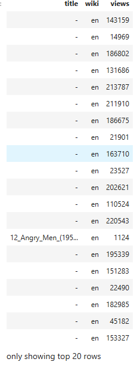


### Grouping the data by page title and order by page views to identify the most viewed pages.

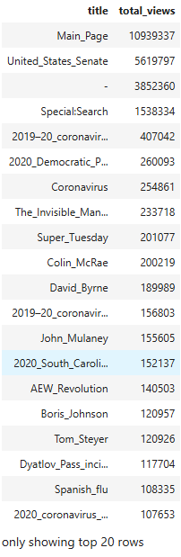

- From the table, we can see that the top 10 most viewed pages are mostly related to Wikipedia's main page, with a total view of 10939337.


### Writing the transformed Spark DataFrame back into a new BigQuery table for further analysis.
```python
  gcs_bucket = 'lab_amali_4'
  bq_dataset = 'wiki'
  bq_table = 'wiki_total_pageviews'
  df_wiki_en_totals.write \
  .format("bigquery") \
  .option("table","{}.{}".format(bq_dataset, bq_table)) \
  .option("temporaryGcsBucket", gcs_bucket) \
  .mode('overwrite') \
  .save()
```


### Use Spark SQL to retrieve the top 10 most-viewed pages where the title contains the word "United."
- Query to fetch the top 10 most viewed pages where the title contains the word "United"
```sql
    select * from encoded-region-425502-u2.wiki.wiki_total_pageviews
      where title like "%United%"
      ORDER BY total_views DESC
      LIMIT 10; 
```

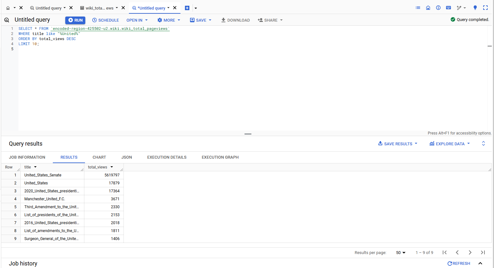


## Performing the same filtering, grouping, and querying operations using Spark SQL instead of DataFrames.

### Using Spark SQL to query the wiki_pageviews temporary view and filter the results based on specific conditions where views is greater than 1000 and wiki is in english version

```python
  df_wiki_en = spark.sql("""
    SELECT
    title, wiki, views
    FROM wiki_pageviews
    WHERE views > 1000 AND wiki in ('en', 'en.m')
    """).cache()
    df_wiki_en
```


### Query to group the views by title from the wiki_en temporary view and orders the results by the total views in descending order

 ```python
  df_wiki_en_totals = spark.sql("""
    SELECT
    title,
    SUM(views) as total_views
    FROM wiki_en
    GROUP BY title
    ORDER BY total_views DESC
    """)
    df_wiki_en_totals
 ```
 

 - The same results is obtained as the previous Dataframe operation (Grouping by title and order by page views to see the top pages). The results are ordered by total views in descending order.


### Writing to BigQuery
```python
  gcs_bucket = 'lab_amali_4'
# Update to your BigQuery dataset name you created
  bq_dataset = 'wiki'
  # Enter BigQuery table name you want to create or overwite.
  # If the table does not exist it will be created when you run the write function
  bq_table = 'wiki_total_pageviews'
  df_wiki_en_totals.write \
  .format("bigquery") \
  .option("table","{}.{}".format(bq_dataset, bq_table)) \
  .option("temporaryGcsBucket", gcs_bucket) \
  .mode('overwrite') \
  .save()
```

### Filtering the Data for Views Greater Than 1000
- Filtering the df_wiki_pageviews DataFrame to include only the rows where views are greater than 1000 and the wiki is either ‘en’ or ‘en.m’. It also selects the columns datehour, wiki, and views, and caches the DataFrame for optimization.

```python
  df_wiki_en = df_wiki_pageviews \
    .select("datehour", "wiki", "views") \
    .where("views > 1000 AND wiki in ('en', 'en.m')") \
    .cache()
    df_wiki_en
```

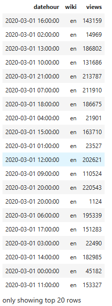

- The results are filtered to include only the rows where views are greater than 1000 and the wiki is in english version, where `2020-03-01 16:00:00` in english version has the most views with 143159.

### Grouping the total views for each datehour by summing up the views column. It then orders the results by total_views in descending order

```python
  import pyspark.sql.functions as F
  df_datehour_totals = df_wiki_en \
  .groupBy("datehour") \
  .agg(F.sum('views').alias('total_views'))
  df_datehour_totals.orderBy('total_views', ascending=False)
```


- The results are ordered by total views in descending order. The results show the total views for each datehour and `2020-03-01 21:00:00` has the highest total views of 1642981.

## Use Pandas and its plotting capabilities to visualize the total views across different date-hour combinations.

### Converting the Spark DataFrame to Pandas DataFrame and set the datehour as the index
```python
  spark.conf.set("spark.sql.execution.arrow.enabled", "true")
  %time pandas_datehour_totals = df_datehour_totals.toPandas()
  pandas_datehour_totals.set_index('datehour', inplace=True)
  pandas_datehour_totals.head()
```
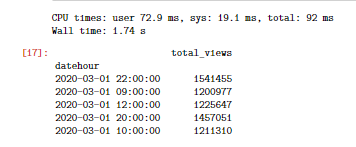

- Converting to pandas DataFrame and setting the datehour as the index. The results show the total views for each datehour to be able to plot the data using matplotlib.

### Creating a line plot of the total views by datehour from the Pandas DataFrame pandas_datehour_totals. 

```python
import matplotlib.pyplot as plt
  pandas_datehour_totals.plot(kind='line',figsize=(12,6));
```

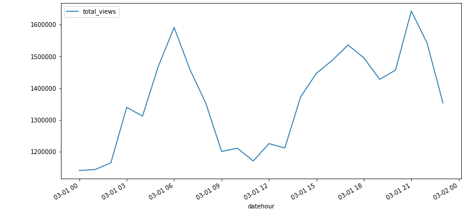

- From the graph , we can see that the total views are highest at `2020-03-01 21` with reference from the table (Refer to the grouping total views.png), `2020-03-01 21` has the highest total views of 1642981.

### A new Spark DataFrame and pivoting the wiki column to create multiple rows for each wiki value.

```python
  import pyspark.sql.functions as F
  df_wiki_totals = df_wiki_en \
  .groupBy("datehour") \
  .pivot("wiki") \
  .agg(F.sum('views').alias('total_views'))
  df_wiki_totals
```
- Grouping the data based on the datehour column, so all rows with the same hour are combined for further operations. Reshaping the data by turning unique values from the wiki column (en, en.m) into separate columns. Each column will represent the total views for that specific Wikipedia site. Calculating the total number of views for each Wikipedia site within each hour and assigns the result to the corresponding column created in the pivot step. 

**The resulting DataFrame contains:**
- One row per datehour, Columns for each unique Wikipedia site (en, en.m), with values showing the total views for that site during the specific hour.

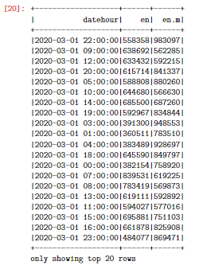

- Converting it to a Pandas DataFrame and plotting the data using matplotlib to visualize the total views for each Wikipedia site

```python
pandas_wiki_totals = df_wiki_totals.toPandas()
pandas_wiki_totals.set_index('datehour', inplace=True)
pandas_wiki_totals.head()
pandas_wiki_totals.plot(kind='line',figsize=(12,6))
```
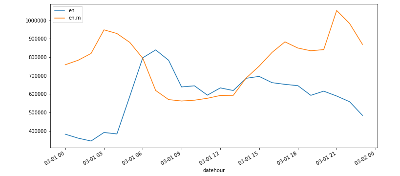


- Traffic for en generally decreases during early hours (around 03-01 06) and then starts to rise later in the day.Traffic for en.m spikes significantly early in the day (03-01 06) and then dips, eventually surpassing desktop traffic during the later hours.There is an interesting crossover point where en.m traffic overtakes en traffic.

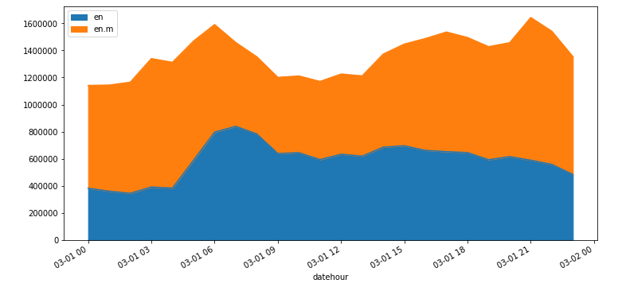


# EXERCISE 2


- Opening an interactive shell with your docker container using command prompt

- Running containers 


```bash
  docker exec -it <container-id> /bin/bash
```

- To see all topics, run
```bash
  kafka-topics --list --bootstrap-server localhost:29092
```
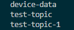

**Writing Spark to read the device data from the topic and writing it a console sink**
- A running Docker container named ed-spark-jupyter-lab (or equivalent) for Spark and Jupyter Lab to be able to start the Spark session in the Jupyter Lab.

```bash
  kafka-console-producer --topic device-data --bootstrap-server localhost:29092
```
**Sample JSON data in the opened terminal**

```bash
  {"eventId": "7146c4a8-54ed-4075-b013-c2d99e65d295", "eventOffset": 10012, "eventPublisher": "device", "customerId": "CI00117", "data": {"devices": [{"deviceId": "D002", "temperature": 5, "measure": "C", "status": "SUCCESS"}]}, "eventTime": "2023-01-05 11:13:53.643895"}
```
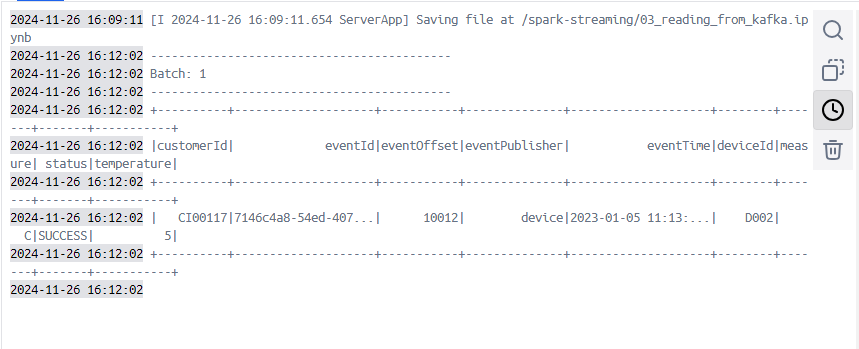

- Execute the code to create the kafka_df dataframe
 - Run the rest of the code in the 03_reading_from_kafka.ipynb script and write the output to console sink to check the output (the last block of code)

**Adding more data**
```bash
{"eventId": "1f547fd-e335-457e-9a1f-686cfbe903e3", "eventOffset": 10013, "eventPublisher": "device", "customerId": "CI00103", "data": {"devices": [{"deviceId": "D004", "temperature": 23, "measure": "C", "status": "SUCCESS"}]}, "eventTime": "2023-01-05 11:13:53.643895"}
{"eventId": "692e9999-1110-4441-a20e-fd76692e2c17", "eventOffset": 10014, "eventPublisher": "device", "customerId": "CI00109", "data": {"devices": [{"deviceId": "D003", "temperature": 18, "measure": "C", "status": "ERROR"}]}, "eventTime": "2023-01-05 11:13:53.643895"}
{"eventId": "a25e37a0-1488-411c-bb6d-f3f14e9bdd39", "eventOffset": 10061, "eventPublisher": "device", "customerId": "CI00115", "data": {"devices": [{"deviceId": "D004", "temperature": 27, "measure": "C", "status": "STANDBY"}, {"deviceId": "D003", "temperature": 4, "measure": "C", "status": "STANDBY"}, {"deviceId": "D003", "temperature": 12, "measure": "C", "status": "STANDBY"}]}, "eventTime": "2023-01-05 11:13:53.650859"}
{"eventId": "0468eae2-156e-4aa0-b730-b8d661b6f075", "eventOffset": 10073, "eventPublisher": "device", "customerId": "CI00119", "data": {"devices": []}, "eventTime": "2023-01-05 11:13:53.650859"}

```


### All bash commands executed

